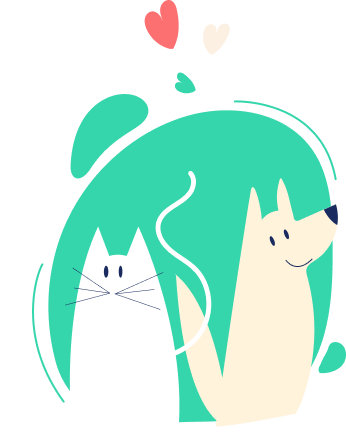

# **Adopet API**

<p align="center">
  
</p>

## [**Link para o Challenge**](https://www.alura.com.br/challenges/back-end-6)
Esta API foi construída durante um Challenge Based Learning proposto pela empresa [Alura](https://www.alura.com.br/) para servir como um projeto prático e que pudesse ser utilizado como portfólio.


> ### Bibliotecas e Ferramentas
* NestJS version 9
* Typescript
* NPM
* Docker
* Postgresql
* TypeORM
* Swagger
* JsonWebToken
* Bcrypt
* Class Validator
* Config

> ### Design Patterns e Patterns
* Dependency Injection
* Decorator
* Query Builder
* Active Record
* RBAC Role Based Access Control
* DTO

> ### NestJS Features
* Modules
* Providers
* Controllers
* Guards
* Pipes
* Custom Decorators
* CLI
* OpenAPI (Swagger)


## Installation

```bash
$ npm install
```

## Running the app

```bash
# development
$ docker compose up -d
$ npm run start:dev
```